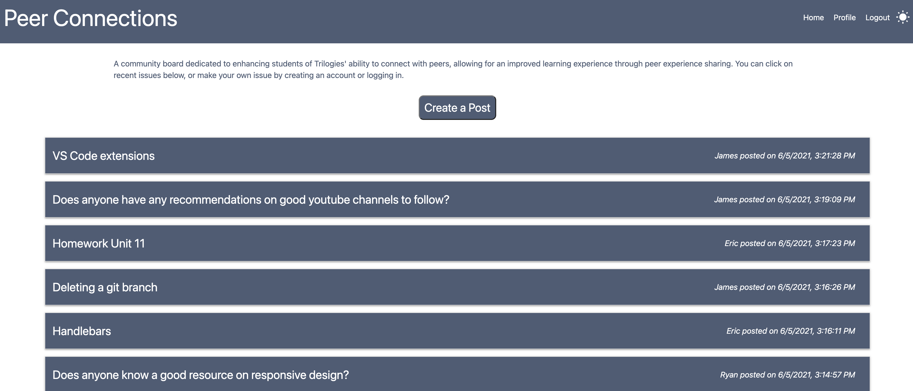

# Peer Connections

# About Peer Connections
  A community board dedicated to enhancing students of Trilogies' ability to connect with peers, allowing for an improved learning experience through peer experience sharing.

  ## Table of Contents
  - [Installation](#Install)
  - [Usage](#usage)
  - [Links](#links)
  - [Contributing](#contributing)
  - [Tests](#Tests)
  - [License](#license)
  - [Credits](#credits)

  ## Installation
  To install necessary dependencies, run the following command:
  > npm i

  ## Usage
  When users visit the site, they have the ability to view posts and comments. Upon creating an account, they're able to create posts and comment on existing posts. 

  ## Links
  Deployed Heroku App Link - https://boiling-lowlands-90882.herokuapp.com/  
  Powerpoint Presentation Link - https://docs.google.com/presentation/d/1sL56NghAsjHWPZ5V_UXPgW5sTKHPAQas/edit#slide=id.p1
  
  ## Contributing
   All contributions are welcomed and appreciated! 

   ## Tests:
  To run tests, run the following command:
  > npm test
  
  ## License:
  MIT
  ## Credits
  - Ryan Scherr https://github.com/ryanascherr  
  - Eric Cole https://github.com/Ecole7853  
  - James Daugherty https://github.com/jamesedaugherty  